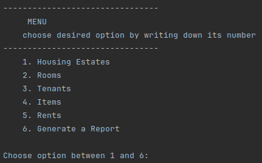

# Housing Estates Management System

This Java project is an application designed to help developers manage housing estates. The system allows the management of apartments, parking spaces, tenants, and their associated details. It also features a cmd user interface for user interaction and provides functionalities such as renting apartments, managing parking spaces, handling tenant information, and more.

## Table of Contents

- [Features](#features)
- [Getting Started](#getting-started)
- [Usage](#usage)
- [Exception Handling](#exception-handling)
- [File Saving](#file-saving)
- [Program Operation](#program-operation)

## Features

- **Apartment Management:** Create, rent, and handle various types of apartments with unique identification numbers and volumes.
- **Parking Space Management:** Manage parking spaces with the ability to store vehicles and items. Ensure compatibility with the space available.
- **Tenant Management:** Keep track of tenants, their rental start and end dates, and handle tenant-related issues.
- **Time Simulation:** Implement a thread mechanism to simulate the passage of time and check rental issues regularly.
- **Exception Handling:** Handle exceptions such as `ProblematicTenantException` and `TooManyThingsException`.

## Getting Started

1. Clone the repository:
    ```bash
    git clone https://github.com/your-username/housing-estates-management.git housing-estates-management
    ```

2. Navigate to the project directory:
    ```bash
    cd housing-estates-management
    ```


3. Compile and run the application:
    ```bash
    javac Main.java
    java Main
    ```

## Usage

Follow the on-screen instructions and use the console-based menu to interact with the application. The GUI interface provides a user-friendly way to manage housing estates.

## Exception Handling

- **Problematic Tenant Exception:** If a person with more than three letters attempts to start renting rooms, a ProblematicTenantException is thrown with a message specifying the problematic person and the list of rented rooms.
- **Too Many Things Exception:** If a room cannot accommodate a new item or vehicle, a TooManyThingsException is thrown with a message guiding the user to remove some old items to insert a new one.

## File Saving

Save the status of persons residing in the housing estate and all data regarding rooms, objects, etc. The saved information is written in a human-readable format, with rooms sorted by volume and room content sorted by item volume and name.

## Program Operation

Start the application and interact with the functionalities via the command console and the implemented menu.
<p align="center">
    
</p>

### Feel free to explore and manage your housing estate efficiently using this application!
